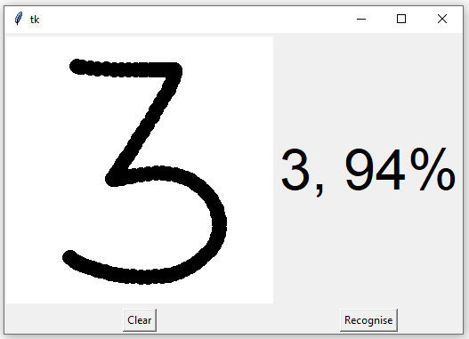
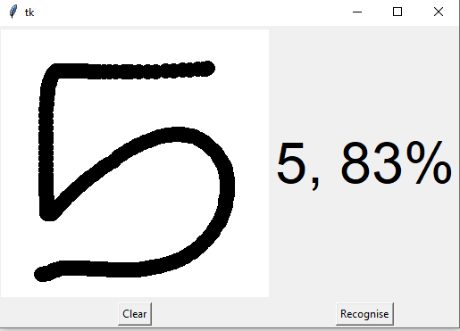
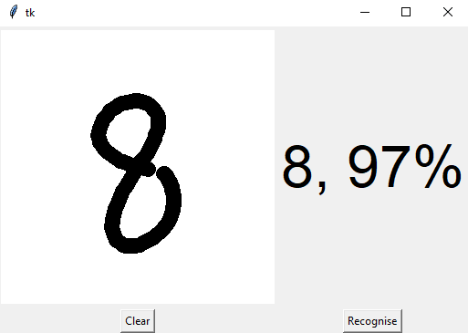
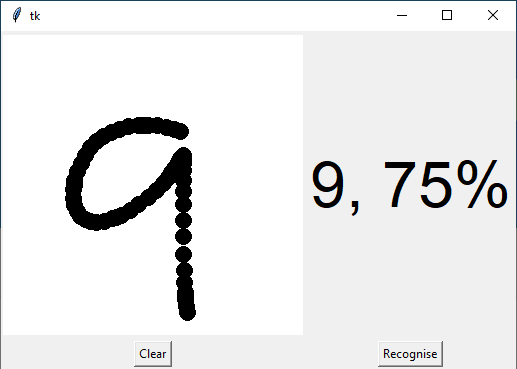

# MNIST-Handwritten-Digit-Recognition

## Digit Recognition System
In real-world scenarios, digit recognition system has been used for online handwriting recognition on computer tablets, numeric entries in forms filled up by hand, recognizing number plates of vehicles, processing bank cheques and many more. This kind of system generally trains itself by recognizing digits from various sources like emails, papers, images, etc

## Problems with handwritten digits
The handwritten digits vary from writing of person to person. They are not always of the same size, width or orientation. The problem is faced by many people when writing a single digit with variety of different handwritings. The general problem is classifying the digits which almost similar such as 1 and 7, 3 and 8, 2 and 5, etc by training the machine.

## [The MNIST dataset](http://yann.lecun.com/exdb/mnist/)
The MNIST dataset contains 60,000 training images of handwritten digits from zero to nine and 10,000 images for testing. Therefore, it has 10 different classes.
The MNIST dataset is trained upto 15 epochs to give almost ***99% accuracy.***

## Building Python Deep Learning model
Deep Learning algorithm- Convolutional Neural Network with Keras library is used to train the model. In the end GUI is built using TKinter library to show predictions.

  

  

  

  

## Steps to implement the project :

*Refer file modeltraining_digitrecognizer.py*
 Step 1: Import the libraries and load the dataset
 Step 2: Preprocess the data
 Step 3: Create the model
 Step 4: Train the model
 Step 5: Evaluate the model and save it
 
 *Refer file digit_recognizer.py*
 Step 6: Create the GUI to predict digits (python digit_recognizer.py)
